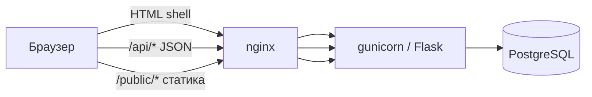

# Архитектура WIRING

Краткое описание того, как устроен репозиторий сейчас, и принципы, по которым его развиваем.

## Стек

| Слой | Технология | Заметки |
|------|------------|---------|
| Сервер | Python 3, **Flask** | API + отдача shell-страницы, без отдельного API-фреймворка |
| БД | **PostgreSQL 16** (прод, local dev и тесты) | `DATABASE_URL` → Postgres (`docker-compose.yml` локально); миграции `init_db()` + `_ensure_column` |
| Прод | **gunicorn** + nginx | см. `deploy/` |
| Клиент | **Preact + TS** (`src/`) + shell (`src/app/`) | Vite → `public/dist/`; постепенная миграция экранов |
| Стили | shell `public/styles.css` + CSS Modules внутри feature bundles | экранные стили не растут в глобальный файл |
| Картинки | **`public/`** | `/public/...` через Flask |
| Зависимости Python | см. `requirements.txt` | Flask, Werkzeug, gunicorn, Pillow; Telethon — только для опционального Telegram-воркера |

Фронт использует Vite только для сборки небольших entrypoint-ов и route-level bundles; тяжёлых UI-библиотек и CSS-фреймворков нет.

## Как запрос попадает в интерфейс

1. Почти все «страницы» (`/`, `/login`, `/feed`, `/chats/...`) — один **`templates/index.html`**: пустой `#app` + подключение собранного shell `public/dist/app.js`.
2. **`src/app/bootstrap.js` — coordinator shell**: ходит в **`/api/*`**, хранит session state в памяти, синхронизирует URL через history API и передаёт typed host bridges в feature bundles. Общий API-клиент вынесен в `src/app/api.ts`, inbox-lifecycle — в `src/app/inbox.ts`, lazy-загрузка feature-бандлов — в `src/app/features.ts`; пользовательские экраны живут в Preact.
3. Отдельные **серверные шаблоны**: `templates/admin.html`, `templates/legal.html` (правила, privacy). Экраны `/support` и `/notifications` вынесены в отдельные Preact-модули; настройки уведомлений живут рядом с профилем.
4. Доменная логика вынесена из монолита в модули рядом с `app.py`: `catalog`, `notify`, `premium`, `media`, `matchmaker`, и т.д.

## Оценка текущей архитектуры

**Сильные стороны**

- **Мало движущихся частей**: один процесс приложения, одна БД, понятный деплой (`deploy.sh`).
- **Мало зависимостей**: нет ORM, нет node_modules, нет лишних слоёв на фронте.
- **Бэкенд уже модульный**: справочники, почта, премиум, модерация — отдельные файлы, тесты `unittest` на API и логику.
- **Подходит продукту**: dating-SPA с сессиями и PostgreSQL — нормальный масштаб без микросервисов.

**Компромиссы (не баги, а долг)**

- **`app.py` большой** — маршруты и часть бизнес-логики в одном файле; дальше новые фичи лучше не раздувать его без нужды.
- **`src/app/bootstrap.js` всё ещё заметный** — в нём остаются routing, session state, API orchestration и host bridges; экранная разметка туда больше не добавляется.
- **Нет отдельного API-контракта** (OpenAPI) — ок для одной команды и одного клиента.
- **UI-граница** — новые экраны и feature-specific handlers добавляются только в `src/features/*`; `bootstrap.js` остаётся orchestration-слоем.
- **Мигрированы в Preact** — auth, home, profile, notification settings, consents, WIRING+, likes, person, deck, account и chats. Старые screen renderers и связанные global styles удалены.

Итого: архитектура **простая и уместная** для WIRING; главный риск — рост двух монолитов (`app.py`, `src/app/bootstrap.js`), его гасим **KISS** и точечным выносом, а не новым стеком.

## Принципы разработки (KISS)

1. **KISS** — выбираем самое простое решение, которое закрывает задачу. Не добавляем слой (ORM, Redux, design system на npm), пока боль без него не станет явной.
2. **Минимум зависимостей** — не тянем объёмные библиотеки, плагины и фреймворки, если можно обойтись стандартной библиотекой, Flask, DOM API или небольшим своим модулем.
3. **Новая зависимость — только с причиной** — в PR/задаче коротко: зачем, почему не stdlib/существующий код, что с размером и обновлениями.
4. **Один клиент, один сервер** — API под текущий SPA; отдельный mobile/API-клиент — отдельное решение, не «на будущее» в коде.
5. **PostgreSQL** на проде, в local dev и тестах (`DATABASE_URL`, `docker compose`).
6. **Frontend** — `src/` (app, components/ui, features/*, entries/*), сборка Vite в `public/dist/`. `templates/index.html` загружает `public/dist/app.js`; `public/app.js` — только compatibility shim. Статика продукта: `public/` (css, media).
7. **Тесты** — `python3 -m unittest discover -s tests`; ручной UI — локально, тестовый пользователь из README.

## Куда класть новый код (шпаргалка)

| Что | Куда |
|-----|------|
| HTTP API, сессии | `app.py` или новый модуль + импорт в `app.py` |
| Справочники, тексты каталога | `catalog.py`, `cities.py`, … |
| Разметка нового экрана | `src/features/<name>/` на Preact |
| Shell-стили и server-template compatibility | `public/styles.css` |
| Стили Preact-экрана | рядом с экраном: `src/features/<name>/*.module.css` |
| Админка / legal HTML | `templates/`, `legal_pages.py` |
| Скрипты dev/seed | `scripts/` |
| Документация продукта/деплоя | `README.md`, `docs/` |

## Связанные документы

- [docs/router.md](router.md) — SPA URLs, `src/router/`, тесты
- [docs/frontend-migration.md](frontend-migration.md) — владельцы экранов и порядок удаления legacy
- [README.md](../README.md) — local, тестовые пользователи, деплой
- [docs/telegram-triage.md](telegram-triage.md) — опциональный Telegram-воркер (Telethon)
- [V2.md](../V2.md) — продуктовые/UI-цели v2

Серверные legal/admin-шаблоны подключают общий Preact `AppHeader` через `src/entries/server-header.tsx` → `public/dist/server-header.js`. Auth также использует `AppHeader`; выбор темы сохраняется общим `src/lib/theme.ts`.

### Vertical discovery feed

`src/features/deck/` owns vertical scroll snap, mouse dragging, keyboard navigation, explicit likes and confirmed exclusions. Scrolling never creates a swipe. Previously loaded cards can be revisited within the current SPA session; acted-on cards are removed from that cache, including actions on the person screen. `src/app/feed.ts` requests two cards at a time through the shared API and cancellable requests.

The gesture viewport fills the available feed width and height, including space beside and below each card. Interactive targets keep their own clicks. Images retain their natural aspect ratio with a 508px width cap and a viewport-dependent height limit; like/exclude sit in a compact separate panel below the card. The scroll container has no focus outline; interactive buttons retain `:focus-visible`. Reduced-motion navigation uses instant scrolling. No visible swipe instruction or reserved instruction row is rendered.

`src/lib/usePhotoSwipe.ts` locks the first clear pointer axis for both deck and person galleries. Horizontal swipes change only the photo; touch vertical scrolling stays native (`touch-action: pan-y`), while vertical mouse drags on a deck card delegate to feed navigation. Interactive elements are excluded from gesture capture and completed drags suppress accidental clicks. Numbered photo buttons/thumbnails and Left/Right keys provide alternatives; the deck announces the current photo and moves focus out of a card when it becomes inactive. A shared Button link in the external action panel is the only profile-opening control for each card. Person photos also retain their natural proportions; reduced motion disables the gallery entrance animation.

`GET /api/feed` accepts `limit` (1–30, default 30), returns `cards` and `has_more`, and sends `Cache-Control: no-store`. `feed.py` reserves eligible candidates in random order in PostgreSQL `feed_history`, with a unique `(user_id, other_id)` pair. Locking the viewer row serializes concurrent page requests. Existing mutual preferences, filters, blocks and privacy checks apply before reservation. The additive `init_db` migration is idempotent and backfills historical passes.

`delivered_at` is committed before the response, so reloads, retries, other tabs and subsequent logins cannot deliver the same candidate again. This deliberately also consumes prefetched cards and responses lost in transit. `POST /api/feed/view` idempotently records `viewed_at` for an already delivered card without creating a swipe. Explicit pass persists `excluded_at` independently of swipe rows. History has no TTL and follows the existing account deletion lifecycle. Legacy `/api/deck/restart` returns 410; `/api/rewind` rejects pass with 409. Likes, matches and message soft-deletion retain their existing lifecycle.

### WIRING+ feed replay

Only the exhausted feed offers “Показать анкеты ещё раз”, with the existing WIRING+ diamond. Free users see the disabled button with an associated short explanation. Premium users confirm in the shared Modal. The feature stays inside the feed; the separate “Проверить новые” action does not reset history. Filters, likes, matches, snoozes, blocks and permanent exclusions keep their existing semantics.

`POST /api/feed/reset` requires a logged-in viewer with a currently active `premium_until`, checked through `is_premium` under the same viewer row lock used for delivery. Its JSON body requires the non-negative integer `generation` returned by `GET /api/feed`. A matching generation deletes only that viewer’s `feed_history` rows whose `excluded_at IS NULL`, then atomically increments `users.feed_generation`. A stale/retried generation returns `reset:false` and the current generation without deleting new deliveries. This additive column is created idempotently in `ensure_feed_history`. No swipes, messages or other viewers’ history are modified. Existing `/api/deck/restart` remains disabled for old clients.

The typed shared API resets and then fetches the first new page. Cancel does not call the API; successful reset clears only the local feed cache and view acknowledgements. Layout restoration prevents the browser’s old end-of-feed snap target from consuming the new pages.

### Jev feed experiment

The optional Jev ranking runs only after the existing `/api/feed` eligibility and delivery checks. Access requires both the single numeric `JEV_BETA_USER_ID` allowlist and that account's persisted `users.jev_feed_enabled` setting. The allowlist is fail-closed when unset. The opt-in client requests pages of ten candidates for ranking; the normal feed keeps its two-card page. The server sends one structured request per delivered page and ranks only that page; provider errors, timeouts, missing keys or malformed answers retain the baseline order. Jev cannot create swipes or matches.

The Jev request contains only coarse pair signals calculated inside WIRING: same-city flag, age-gap band and shared dating-intent count. It omits profile fields, account IDs, names, photos, free-text content, messages and diagnosis tags. Configure `JEV_API_KEY` only in local ignored `.env` or production `/etc/wiring.env`; never in client code. The feed remains experimental and its scores are not calibrated match probabilities.
