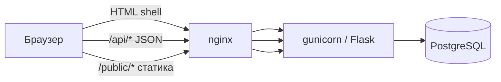

# Архитектура WIRING

Краткое описание того, как устроен репозиторий сейчас, и принципы, по которым его развиваем.

## Стек

| Слой | Технология | Заметки |
|------|------------|---------|
| Сервер | Python 3, **Flask** | API + отдача shell-страницы, без отдельного API-фреймворка |
| БД | **PostgreSQL 16** (прод, local dev и тесты) | `DATABASE_URL` → Postgres (`docker-compose.yml` локально); миграции `init_db()` + `_ensure_column` |
| Прод | **gunicorn** + nginx | см. `deploy/` |
| Клиент | **Preact + TS** (`src/`) + shell (`src/app/`) | Vite → `public/dist/`; постепенная миграция экранов |
| Стили | один **`public/styles.css`** | |
| Картинки | **`public/`** | `/public/...` через Flask |
| Зависимости Python | см. `requirements.txt` | Flask, Werkzeug, gunicorn, Pillow; Telethon — только для опционального Telegram-воркера |

Фронт использует Vite только для сборки небольших entrypoint-ов и route-level bundles; тяжёлых UI-библиотек и CSS-фреймворков нет.

## Как запрос попадает в интерфейс

1. Почти все «страницы» (`/`, `/login`, `/feed`, `/chats/...`) — один **`templates/index.html`**: пустой `#app` + подключение собранного shell `public/dist/app.js`.
2. **`src/app/bootstrap.js`** пока содержит legacy-совместимый shell, ходит в **`/api/*`**, хранит состояние в памяти и синхронизирует URL через history API. Общий API-клиент вынесен в `src/app/api.ts`, inbox-lifecycle — в `src/app/inbox.ts`, lazy-загрузка feature-бандлов — в `src/app/features.ts`; экраны постепенно переходят на Preact.
3. Отдельные **серверные шаблоны**: `templates/admin.html`, `templates/legal.html` (правила, privacy, support).
4. Доменная логика вынесена из монолита в модули рядом с `app.py`: `catalog`, `notify`, `premium`, `media`, `matchmaker`, и т.д.

## Оценка текущей архитектуры

**Сильные стороны**

- **Мало движущихся частей**: один процесс приложения, одна БД, понятный деплой (`deploy.sh`).
- **Мало зависимостей**: нет ORM, нет node_modules, нет лишних слоёв на фронте.
- **Бэкенд уже модульный**: справочники, почта, премиум, модерация — отдельные файлы, тесты `unittest` на API и логику.
- **Подходит продукту**: dating-SPA с сессиями и PostgreSQL — нормальный масштаб без микросервисов.

**Компромиссы (не баги, а долг)**

- **`app.py` большой** — маршруты и часть бизнес-логики в одном файле; дальше новые фичи лучше не раздувать его без нужды.
- **`src/app/bootstrap.js` пока большой** — старые экраны ещё живут внутри shell; новые экраны выносятся в `src/features/*`, после чего соответствующий legacy-код удаляется.
- **Нет отдельного API-контракта** (OpenAPI) — ок для одной команды и одного клиента.
- **Основная зона миграции** — legacy-shell: новые экраны не добавляются в `bootstrap.js`, а существующие переносятся по одному в `src/features/*`.
- **Уже мигрированы в Preact** — auth, home, profile, consents, WIRING+ и chats; legacy-разметка этих экранов пока сохраняется только как fallback до отдельной чистки.

Итого: архитектура **простая и уместная** для WIRING; главный риск — рост двух монолитов (`app.py`, `src/app/bootstrap.js`), его гасим **KISS** и точечным выносом, а не новым стеком.

## Принципы разработки (KISS)

1. **KISS** — выбираем самое простое решение, которое закрывает задачу. Не добавляем слой (ORM, Redux, design system на npm), пока боль без него не станет явной.
2. **Минимум зависимостей** — не тянем объёмные библиотеки, плагины и фреймворки, если можно обойтись стандартной библиотекой, Flask, DOM API или небольшим своим модулем.
3. **Новая зависимость — только с причиной** — в PR/задаче коротко: зачем, почему не stdlib/существующий код, что с размером и обновлениями.
4. **Один клиент, один сервер** — API под текущий SPA; отдельный mobile/API-клиент — отдельное решение, не «на будущее» в коде.
5. **PostgreSQL** на проде, в local dev и тестах (`DATABASE_URL`, `docker compose`).
6. **Frontend** — `src/` (app, components/ui, features/*, entries/*), сборка Vite в `public/dist/`. `templates/index.html` загружает `public/dist/app.js`; `public/app.js` — только compatibility shim. Статика продукта: `public/` (css, media).
7. **Тесты** — `python3 -m unittest discover -s tests`; ручной UI — локально, тестовый пользователь из README.

## Куда класть новый код (шпаргалка)

| Что | Куда |
|-----|------|
| HTTP API, сессии | `app.py` или новый модуль + импорт в `app.py` |
| Справочники, тексты каталога | `catalog.py`, `cities.py`, … |
| Разметка нового экрана | `src/features/<name>/` на Preact |
| Временная legacy-разметка | `src/app/bootstrap.js` до миграции экрана |
| Общие стили | `public/styles.css` (+ при появлении UI-kit — отдельный css рядом) |
| Админка / legal HTML | `templates/`, `legal_pages.py` |
| Скрипты dev/seed | `scripts/` |
| Документация продукта/деплоя | `README.md`, `docs/` |

## Связанные документы

- [docs/router.md](router.md) — SPA URLs, `src/router/`, тесты
- [docs/frontend-migration.md](frontend-migration.md) — владельцы экранов и порядок удаления legacy
- [README.md](../README.md) — local, тестовые пользователи, деплой
- [docs/telegram-triage.md](telegram-triage.md) — опциональный Telegram-воркер (Telethon)
- [V2.md](../V2.md) — продуктовые/UI-цели v2
